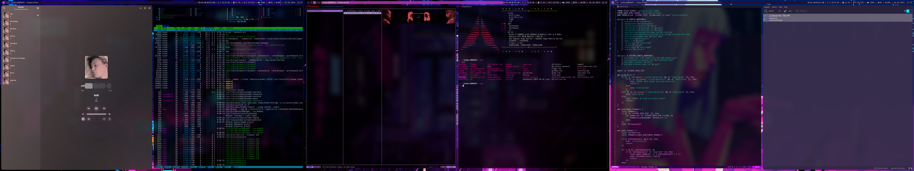
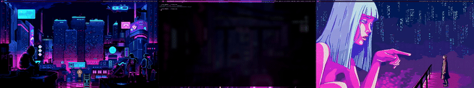
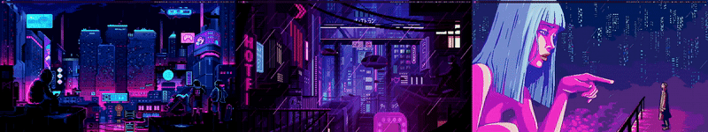
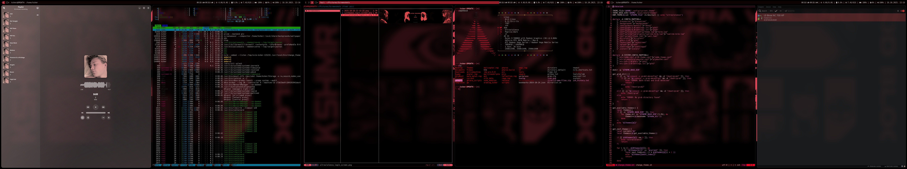
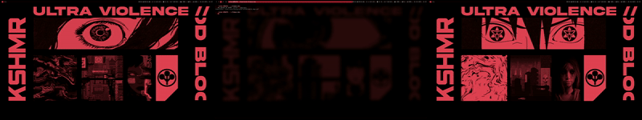
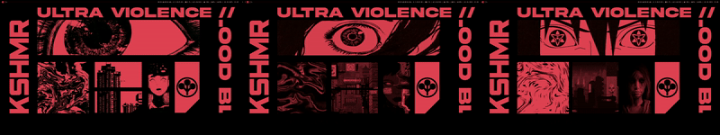

# OMGWTH

A comprehensive rice featuring a unified theme-switching system that seamlessly transforms your entire desktop environment with a single command.

## Features

- **Unified Theme System**
- **Triple Monitor Support**
- **Custom Background and Splash Screen Implementations**
- **Two Built-in Themes**

## Gallery

### Synthwave Theme


_Main desktop view with synthwave theme_


_SDDM login screen_


_Lock screen (slock)_


_Boot splash screen animation_


_Wallpaper showcase across 3 monitors_

### Ultraviolence Theme


_Main desktop view with ultraviolence theme_


_SDDM login screen_


_Lock screen (slock)_


_Boot splash screen animation_


_Wallpaper showcase across 3 monitors_

## Components

### Window Manager & Core

- **DWM**
- **dmenu**
- **dwmblocks**
- **st**
- **SDDM**
- **slock**

### Applications

- **Neovim** - Text editor with custom colorscheme integration
- **Yazi** - Terminal file manager
- **Zsh** - Shell with custom colors

### Theme Components

The unified theme system affects:

- Background
- dircolors
- dmenu
- dunst
- DWM
- GRUB theme
- GTK configurations
- Neovim
- Plymouth
- slock
- st
- Xresources
- Yazi
- Zsh

## Theme Switching

Switch between themes with a single command:

```bash
# List themes
change_theme.sh list

# Rotate to next available theme
change_theme.sh

# Switch to specific theme
change_theme.sh $theme_name

```

### Adding Your Own Theme

1. Create a new theme directory:

```bash
mkdir -p $HOME/.local/themes/mytheme
```

2. Add configuration files for each component:

```bash
themes/mytheme/
├── backgrounds            # File containing paths to backgrounds to be used by screenweaver
├── dunst                  # Dunst config file
├── faceicon.png           # SDDM face icon
├── gtk2                   # GTK 2 config file
├── gtk3                   # GTK 3 config file
├── gtk4                   # GT5 4 config file
├── nvim.lua               # File containing lua call to nvim with colorscheme to be used
├── lualine-nvim.lua       # Lualine colorscheme
├── yazi.toml              # Yazi theme file
├── dircolors              # Dircolors configuration
├── lockscreen             # File containing paths to pictures to be used by slock
├── splash                 # File containing paths to splash screens to be used by simplesplash
├── Xresources             # Xresources configuration
├── xsettingsd             # Xsettingsd configuration
└── zcolors                # Zsh file containing color definitions
```

3. Apply your theme:

```bash
change_theme.sh mytheme
```

### Setup Theme For Some Other Software

The script change_theme.sh is located inside $HOME/.local/bin but is copied to /usr/local/bin on setup.

1. Add config path and filename for the config inside the configuration maps:

```bash
declare -A CONFIG_MAPPING=(
    [".backgrounds"]="backgrounds"
    [".config/dunst/dunstrc"]="dunst"
    [".config/gtk-3.0/settings.ini"]="gtk3"
    [".config/gtk-4.0/settings.ini"]="gtk4"
    [".config/nvim/lua/config/theme.lua"]="nvim.lua"
    [".config/nvim/lua/plugins/lualine-nvim.lua"]="lualine-nvim.lua"
    [".config/yazi/theme.toml"]="yazi.toml"
    [".dircolors"]="dircolors"
    [".gtkrc-2.0"]="gtk2"
    [".face.icon"]="faceicon.png"
    [".lockscreen"]="lockscreen"
    [".splash"]="splash"
    [".Xresources"]="Xresources"
    [".xsettingsd"]="xsettingsd"
    [".zcolors"]="zcolors"
)

declare -A SYSTEM_CONFIG_MAPPING=(
    ["/etc/sddm.conf.d/10-theme.conf"]="sddm_theme.conf"
    ["/etc/plymouth/plymouthd.conf"]="plymouthd.conf"
    ["/etc/gtk-2.0/gtkrc"]="gtk2"
    ["/etc/gtk-3.0/settings.ini"]="gtk3"
)
```

2. If the software needs to be reloaded create reload function and add it to the set_theme() function:

```bash
set_theme() {
    local theme_name="$1"
    local theme_dir="$THEME_BASE_DIR/$theme_name"

    if [[ ! -d "$theme_dir" ]]; then
        echo "Error: Theme '$theme_name' does not exist"
        return 1
    fi

    echo "$theme_name" > "$THEME_FILE"
    flip_all_configs "$theme_name"
    flip_system_configs "$theme_name"
    xrdb merge "$HOME/.Xresources"
    set_grub_theme "$theme_name"
    set_background
    reload_st
    update_nvim "$theme_name"
    reload_xsettingsd
    reload_zsh
    killall dunst
    yazi-restart
    reload_dwm


    echo "${theme_name^} theme activated!"
}
```

## Contributing

Feel free to fork this repository and customize it to your needs. If you create new themes or improvements, pull requests are welcome!

## License

This dotfiles repository is available under the MIT License. Individual components (DWM, dmenu, st, slock) retain their original licenses.

## Acknowledgments

- [suckless.org](https://suckless.org) - For the amazing suite of tools
- DWM community - For patches and inspiration.
- Wallpaper Engine theme [Retrowave: Aviators, Multiple Universes](https://steamcommunity.com/sharedfiles/filedetails/?id=2608134975) - For the idea and base for SDDM synthwave theme.
- Wallpaper Engine themes [Ultra Violence](https://steamcommunity.com/sharedfiles/filedetails/?id=2924473476) and [Ultra Violence 2](https://steamcommunity.com/sharedfiles/filedetails/?id=3135349796) - For the idea and base for ultraviolence backgrounds.
- r/unixporn - For endless rice inspiration.
